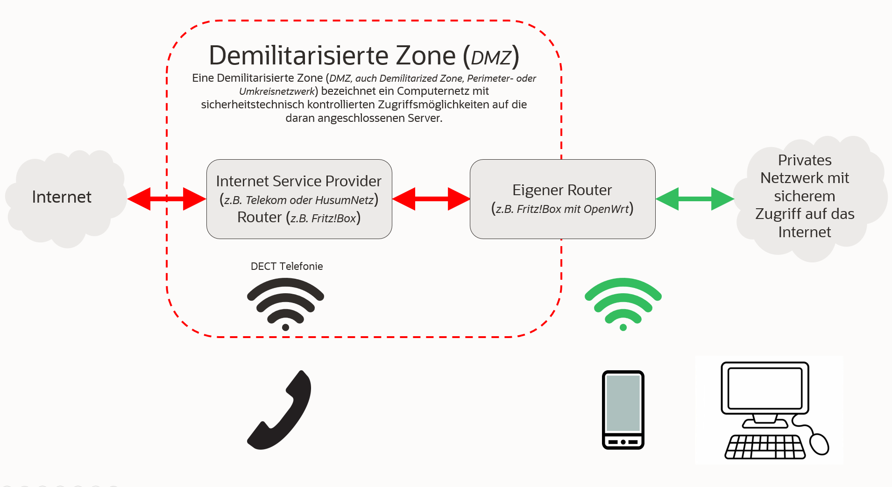

# Die Bösen bleiben draußen (*Meine zentrale Firewall*)

## Inhaltsverzeichnis
<!-- TOC depthFrom:1 depthTo:6 withLinks:1 updateOnSave:0 orderedList:0 -->

- [**Home** (*zurück zu Private Internet Sicherheit*)](https://github.com/hmielimo/private.internet.sicherheit)
- [Einleitung](#einleitung)

<!-- /TOC -->

## Einleitung

Hier stelle ich Ihnen an einem konkreten Beispiel (*FritzBox, OpenWrt*) vor, wie Sie bei sich zuhause mit vergleichsweise einfachen Mitteln die Internet-Sicherheit verbessern können. Wir erstellen einen individuell eingerichteten Router (*z.B. gebrauchte FritzBox*) mit folgenden Sicherheitsmerkmalen:
- Keine Werbung und Tracker mit Adblock-Addon
  - Viele Leute verwenden bereits Adblocker-Plugins in ihren Desktop-Browsern, aber was ist, wenn Sie Ihr Smartphone, Tablet, Ihre Uhr oder ein anderes (*WLAN-*)Gadget verwenden!? Das Entfernen lästiger Werbung, Tracker und anderer Missbrauchsseiten (*wie Facebook*) ist ganz einfach: Blockieren Sie sie mit Ihrem Router.
  - Hier werden folgene Blockinglisten eingesetzt und so über 50.000 Inhalte bzw. Server "ausgesperrt":
    - [adaway](https://github.com/AdAway/adaway.github.io) ~ 10.000 geblockte Inhalte bzw. Server
    - [adguard](https://adguard.com/de/welcome.html) ~ 30.000 geblockte Inhalte bzw. Server
    - [disconnect](https://disconnect.me/) ~ 10.000 geblockte Inhalte bzw. Server
    - [yoyo](https://pgl.yoyo.org/adservers/) ~ 10.000 geblockte Inhalte bzw. Server
- Verschlüsselte DNS Anfragen
  - Anfragen zu DNS-Servern werden im Normalfall unverschlüsselt versendet. Das bedeutet: Selbst wenn ihr einen unzensierten und freien DNS-Server gewählt habt, besteht die Möglichkeit, dass jemand eure DNS-Anfragen mitliest und auswertet – DNS ist damit grundsätzlich anfällig für [Man-in-the-Middle-Angriffe](https://de.wikipedia.org/wiki/Man-in-the-Middle-Angriff). Wir sichern die Umgebung durch [DNS over TLS (DoT)](https://de.wikipedia.org/wiki/DNS_over_TLS).
- Firewall zur Kontrolle des Datenverkehrs
- Drei (*LAN1, LAN2, LAN3*) getrennte Netzwerke zur besseren Trennung (*z.B. PV Anlage, internetfähige Geräte (z.B. Fernseher, Mähroboter, Saug- und Wisch-Roboter)*)
- Sicheres (*u.a. ohne Client-to-Client Kommunikation*) WiFi mit Fast Roaming
Das könnte dann in etwa so aussehen:

Komponenten:
- ISP Router 
- Privater bzw. eigener Router 
