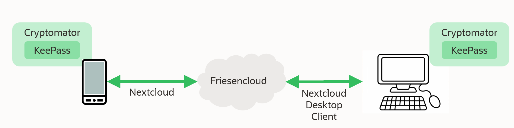

# Sicher ist sicher (*Sichere Verwaltung meiner Passwörter*)

## Inhaltsverzeichnis
<!-- TOC depthFrom:1 depthTo:6 withLinks:1 updateOnSave:0 orderedList:0 -->

- [**Home** (*zurück zu Private Internet Sicherheit*)](https://github.com/hmielimo/private.internet.sicherheit)
- [Einleitung](#einleitung)
- [Passwoerter und Schluessel](#passwoerter-und-schluessel)
- [Einbindung und Integration](#einbindung-und-integration)

<!-- /TOC -->

## Einleitung

Sie haben Ihre persönliche Motivation sich für das Thema zu interessieren. Ich könnte mir z.B. folgende Motivation vorstellen:

| Motivation | Erklärung | mögliche Lösungskomponente(n)   |
| ---------- | --------- | ----- |
| Sie suchen nach einem eigenen Platz für Ihre Passwörter. | Ihren Hausschlüssel tragen Sie i.d.R. immer bei sich. | [Cryptomator](https://cryptomator.org/de/), [KeePassXC](https://keepassxc.org/) |
| Sie benötigen Ihre Passwörter auf unterschiedlichen Endgeräten (*z.B. Computer, Handy*). | Jeder in Ihrer Familie verfügt über einen eigenen Hausschlüssel. | [Nextcloud](https://nextcloud.com/de/files/) bzw. [Friesencloud](https://www.stadtwerke-husum.de/friesencloud/) |
| Sie möchten sich nicht mehrere Passwörter merken müssen. | Lieber sich ein [sicheres Passwort](https://en-m-wikipedia-org.translate.goog/wiki/Password_strength?_x_tr_sl=en&_x_tr_tl=de&_x_tr_hl=de&_x_tr_pto=wapp) merken und weitere sichere automatisch erzeugen/verwalten als sich mehrere unsichere Passwörter zu merken. | [Diceware](https://de.wikipedia.org/wiki/Diceware), [KeePassXC](https://keepassxc.org/) |
| Die Sicherheit Ihrer Passwörter ist Ihnen wichtig. | Ihren Hausschlüssel vertrauen Sie nicht leichtfertig Dritten an. | [Cryptomator](https://cryptomator.org/de/), [KeePassXC](https://keepassxc.org/) |

Hier stelle ich Ihnen an einem konkreten Beispiel (*Passwort-Manager, Diceware, Friesencloud*) vor, wie Sie Ihre Passwörter sicher verwalten und auch auf verschiedenen Endgeräten (*z.B. Handy*) verfügbar machen können.

## Passwoerter und Schluessel

Alle Passwörter und Schlüssel sind im Verzeichnis C:\Users\\[Benutzername]\Nextcloud\Passwort (*z.B. C:\Users\Max\Nextcloud\Passwort*)  hinterlegt. Dieses Verzeichnis ist mit [Cryptomator](https://cryptomator.org/de/) verschlüsselt. Das Passwort zur Entschlüsselung wird nach jedem Neustart abgefragt. Zusätzlich befindet sich in diesem Verzeichnis ein [KeePassXC](https://keepassxc.org/) Tresor (*Passwort.kdbx*). Das Passwort zur Entschlüsselung dieses Tresors wird ebenfalls nach jedem Neustart abgefragt. In diesem Tresor befinden sich neben allen Passwörtern und Keys auch sonsigen für Sie relevanten Geheimnisse.

Der einzige Schlüssel der nicht gespeichert wird is das Passwort mit dem Sie das Cryptomator Verzeichnis und den Tresor verschlüsseln. Dieses Passwort müssen Sie sich merken und es muss sicher sein. [**Diceware**](https://de.wikipedia.org/wiki/Diceware) hilft Ihnen dabei ein geeignetes Passwort zu finden.

## Einbindung und Integration

### Einbindung

Die mit KeePassXC verwalteten Passwörter stehen durch die [Browser Integration](https://keepassxc.org/docs/KeePassXC_GettingStarted#_setup_browser_integration) z.B. in Chrome, Firefox oder Microsoft Edge zur Verfügung. [KeePassDX](https://play.google.com/store/apps/details?id=com.kunzisoft.keepass.free) ermöglicht das auch auf Android und [Strongbox](https://apps.apple.com/us/app/strongbox-password-safe/id897283731) auf iOS.

### Integration in Friesencloud
Das Verzeichnis C:\Users\\[Benutzername]\Nextcloud\Passwort (*z.B. C:\Users\Max\Nextcloud\Passwort*) wird mit dem [Nextcloud Desktop Client](https://docs.nextcloud.com/desktop/3.8/) automatisch mit Ihrer [Friesencloud](https://www.stadtwerke-husum.de/friesencloud/) syncronisiert. Eine automatiche Syncronisation steht ebenfalls für [Android](https://play.google.com/store/apps/details?id=com.nextcloud.client&hl=en&gl=US) und [iOS](https://apps.apple.com/nl/app/nextcloud/id1125420102) zur Verfügung.
