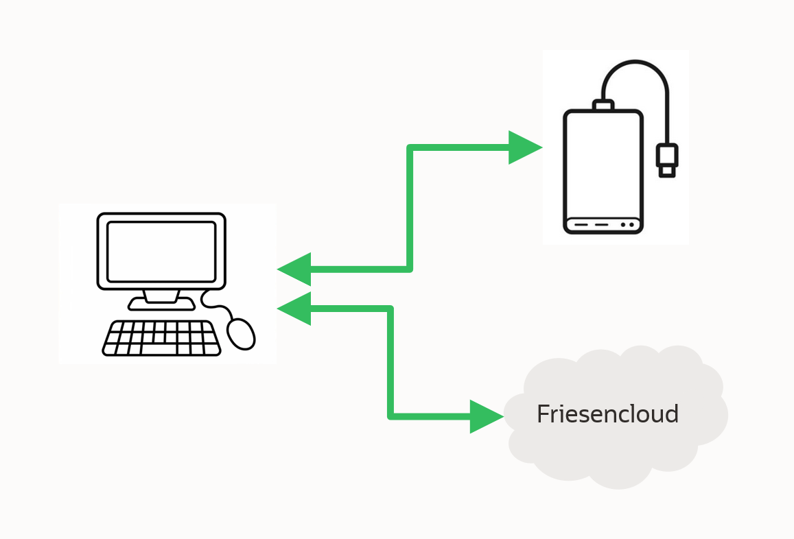

# Für den Fall der Fälle (*Datensicherung und Wiederherstellung*)

## Inhaltsverzeichnis
<!-- TOC depthFrom:1 depthTo:6 withLinks:1 updateOnSave:0 orderedList:0 -->

- [**Home** (*zurück zu Private Internet Sicherheit*)](https://github.com/hmielimo/private.internet.sicherheit)
- [Einleitung](#einleitung)
- [Welche Daten benötigen Sie?](#welche-daten-benoetigen-sie)
- [Wie aktuell soll die Sicherung sein?](#wie-aktuell-soll-die-sicherung-sein)
- [Wieviel Sicherheit benötigen Sie?](#wieviel-sicherheit-benoetigen-sie)
- [Die Umsetzung](#die-umsetzung)
  - [Die Sicherung](#die-sicherung)
  - [Die Wiederherstellung](#die-wiederherstellung)
  - [Das Testen](#das-testen)

<!-- /TOC -->

## Einleitung

Sie nutzen Computer und/oder Smartphones? Haben Sie sich je gefragt, was passiert wenn eines Ihrer Geräte kaputt geht? Fall Sie diese Frage ganz entspannt läßt haben Sie ein gutes und zuverlässiges Sicherungs-Konzept.

Sie haben sich folgende Fragen beantwortet:
- Welche Daten benötigen Sie?
- Wie aktuell soll die Sicherung sein?
- Wieviel Sicherheit benötigen Sie?

Damit ist bereits alles erledigt. Wirklich - ganz einfach. Ja, wirklich. Wir zeigen hier auf wie das gehen kann.

## Welche Daten benoetigen Sie

Bevor wir jetzt ganz tief in bestimmte Datenbereiche eintauchen, machen wir es ganz einfach. Teilen Die Ihren Computer einfach in zwei Bereiche auf. Alles was der Computer benötigt (hier am Beispiel Microsoft Windows) kommt auf Laufwerk C: und alles was Sie benötigen kommt auf Laufwerk D:

Ob jetzt jedes Laufwerk eine eigene Festplatte oder SSD hat spielt dabei keine Rolle. Wichtig ist nur, dass Sie nachdem Ihr Computer kaputt gegangen ist und Sie eine neuen gekauft haben, leicht alle Ihre Daten auf Laufwerk D: wiederherstellen können.

## Wie aktuell soll die Sicherung sein

Sie arbeiten mit Ihren Daten und verändern diese laufend. Hier geht es darum ob die sehr zeitnah (*z.B. täglich*) oder etwas seltener (*z.B. wöchentlich*) sichern möchten.
Ein möglicher Standard ist z.B.:

- tägliche Sicherung: (*inkrementelle*) lokale Kopie (*z.B. externe Festplatte*)
- quartalsweise Sicherung: vollständige externe Kopie (*z.B. Friesencloud*)

## Wieviel Sicherheit benoetigen Sie

Lassen Sie uns dieses Thema in zwei Bereiche aufgliedern:
- Verschlüsselung Ja oder Nein?
- Mehrstufigkeit Ja oder Nein?

Zuerst zur Verschlüsselung. Ihre Daten sind ggf. sensibel oder Sie möchten nicht, dass dritte diese Daten bekommen bzw. sehen. Dann ist Verschlüsselung ein gutes Instrument um das zu erreichen. Denken Sie daran, bevor Sie sich entscheiden, dass ggf. Ihr Rechner verloren gehen oder gestohlen werden kann. Sollten Sie sich für eine Verschlüsselung entscheiden, ich nutze privat z.B. die [freie Software](https://de.wikipedia.org/wiki/Freie_Software) [Cryptomator](https://cryptomator.org/de/).

Jetzt zur Mehrstufigkeit. Damit ist gemeint, dass sie mehrere Sicherungskopien vorhalten. Ähnlich wie Ersatzschlüssel. Wenn ein Schlüssel verloren gehen sollte, haben Sie den Ersatzschlüssel, wenn der Ersatzschlüssel, aus welchen Grund auch immer, nicht verfügbar sein sollte, freut man sich über den zweiten Ersatzschlüssel. Genauso ist es bei den Sicherungskopien. Wenn sie diese brauchen muß sie verfügbar sein. Es ist also nur eine Frage ihrer ganz persönlichen Risikobereitschaft ob Sie eine oder mehere Sicherungskopien anfertigen möchten. Da heutzutage Speicherplatz sehr günstig ist steht einer Mehrstufigkeit eigentlich nichts im Wege.

Einen letzten Punkt möchte ich zum Thema Sicherheit erwähnen: Die Verwendung von Software oder Diensten. Es ist sicher eine gute Idee sich davon zu überzeugen, dass die Software oder der Dienst über einen langen Zeitraum zur Verfügung stehet und auch aktualisiert wird - er sollte auch sicher sein. Dazu kann man ggf. [Deine Daten sicher im Cloud-Speicher verschlüsseln: Wie du durch Open Source deine Datensicherheit weiter erhöhst](https://cryptomator.org/de/open-source/) lesen.

## Die Umsetzung

Jetzt, das Sie wissen was Sie benötigen, lassen Sie uns das einfach umsetzen.

### Die Sicherung

Vorbereitend benötigen Sie zwei Dinge: Ein Speichermedium um die Sicherung abzugelen. Und eine Software um die Sicherung anzufertigen.

Das Speichermedium kann vieles sein, lassen Sie mich einige Beispiele aufzählen:

- USB Festplatte (siehe dazu [Externe Festplatte](https://de.wikipedia.org/wiki/Externe_Festplatte))
- Network Attached Storage NAS (siehe dazu [Network Attached Storage](https://de.wikipedia.org/wiki/Network_Attached_Storage))
- Cloudspeicher (siehe dazu [Filehosting](https://de.wikipedia.org/wiki/Filehosting))

Beim Cloudspeicher möchte ich auf eine Besonderheit hinweisen. Mit [Nextcloud](https://nextcloud.com/de/) steht hier eine deutsche [freie Software](https://de.wikipedia.org/wiki/Freie_Software) zur Verfügung.

Egal für welches Speichermedium sie sich entscheiden am Ende steht es als Laufwerk S: zur Verfügung. Damit können alle Daten von D: nach S: transferiert werden.

Die Software [rclone](https://rclone.org/) die ich privat verwende ist ebenfalls [freie Software](https://de.wikipedia.org/wiki/Freie_Software). Das Script mit dem Sie sichern könnte also in etwa so aussehen.

~~~
set mysync=C:\bin\rclone
set mysyncparam=--progress --create-empty-src-dirs --log-level NOTICE --checksum --transfers=8 --fast-list
set Quelle=D:
set Sicherung=S:
@ECHO OFF
SET /P _inputname= Druecke eine beliebige Taste um den Backup zu starten
@ECHO BACKUP
%mysync% sync "%Quelle%" "%Sicherung%" %mysyncparam%
SET /P _inputname= Druecke eine beliebige Taste um das Fenster zu schliessen
~~~

### Die Wiederherstellung

Beim Wiederherstellen ändern Sie einfach Quelle und Sicherung um die Sicherung auf D: zu schreiben. Bitte seien Sie vorsichtig, denn dann werden alle Daten auf D: überschrieben.

~~~
set mysync=C:\bin\rclone
set mysyncparam=--progress --create-empty-src-dirs --log-level NOTICE --checksum --transfers=8 --fast-list
set Quelle=D:
set Sicherung=S:
@ECHO OFF
SET /P _inputname= Druecke eine beliebige Taste um den Wiederherstellungsprozess zu starten
@ECHO BACKUP
%mysync% sync "%Sicherung%" "%Quelle%" %mysyncparam%
SET /P _inputname= Druecke eine beliebige Taste um das Fenster zu schliessen
~~~

### Das Testen

Es ist wichtig sowohl das Sichern als auch das Wiederherstellen regelmäßig zu überprüfen. Einmal im Jahr sollte reichen. Es soll im Fall der Fälle ja auch wirklich funktionieren.
